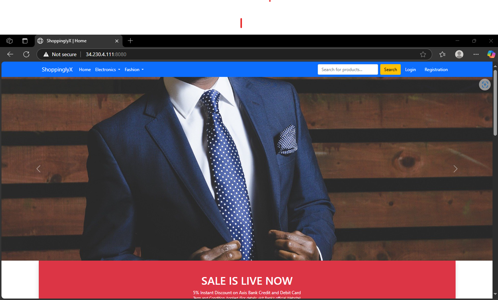
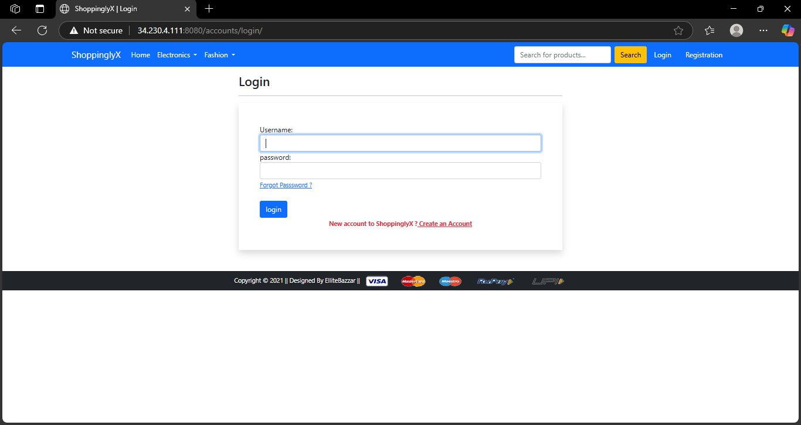
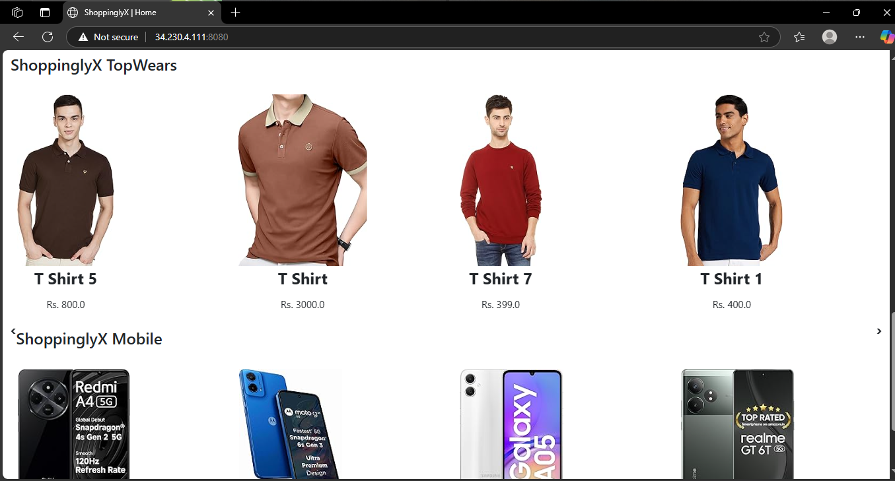

# Ecommerce Django Docker Project

This is a simple ecommerce web app built using *Django* and containerized with *Docker*.

## Features
- Product listing
- User registration & login
- Add to cart
- Responsive UI
- Dockerized setup

## Technologies Used
- Python & Django
- Docker & Docker Compose
- SQLite (for development)

## Screenshots
### Homepage


### Login/Signup


### Product List


## Setup Instructions

```bash
# Clone the repo
git clone https://github.com/MukulNvm/ecommerce-django-docker.git
cd ecommerce-django-docker

# Build Docker containers
docker-compose up --build

# Open in browser
http://localhost:8000

## License
This project is licensed under the MIT License - see the [LICENSE](LICENSE) file for details.
